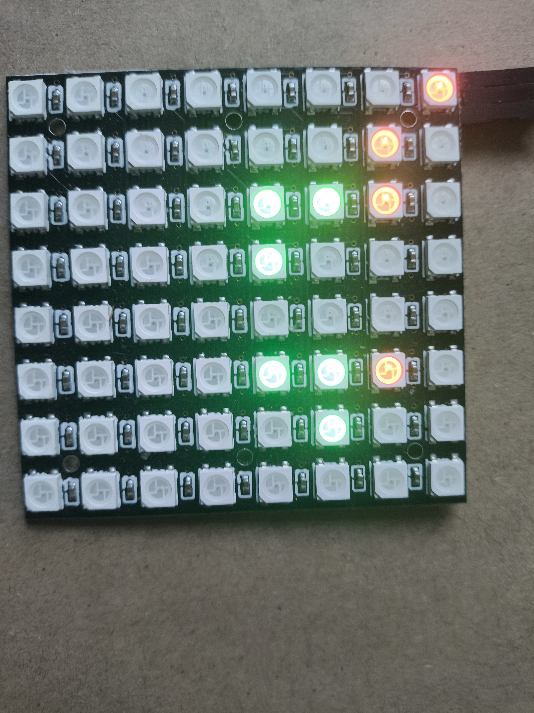

# Computer Usage Monitor (WS2812 LED matrix 8x8)

A **WS2812 LED matrix** 8x8 project that displays your computer’s current usage in real time.  
Controlled by an **RP2040**, which receives data from a **Python script** running on your PC.

---

## Features

- **Two display modes:**
  1. **Hexadecimal percentage display** – usage shown as a hex value.
  2. **Percentage bar display** – each LED represents **12.5%** usage.

- **Displayed system metrics:**
  - CPU usage
  - RAM usage
  - GPU usage
  - GPU VRAM usage

---

## Limitations

- The Python script **only works** with **NVIDIA GPUs** (requires NVIDIA-SMI).
- PC communicates with the RP2040 or other µC via **serial connection**.

---

